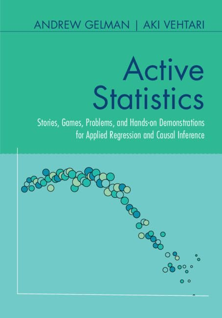

-------------

## Information

Web page for the book *Active Statistics* by [Andrew Gelman](http://www.stat.columbia.edu/~gelman/) and [Aki Vehtari](https://users.aalto.fi/~ave/).

Published by Cambridge University Press in 2024 (March). 
© Copyright by Andrew Gelman and Aki Vehtari 2024.

This book provides statistics instructors and students with complete classroom material for a one- or two-semester course on applied regression and causal inference. It is built around 52 stories, 52 class-participation activities, 52 hands-on computer demonstrations, and 52 discussion problems that allow instructors and students to explore in a fun way the real-world complexity of the subject. The book fosters an engaging 'flipped classroom' environment with a focus on visualization and understanding. The book provides instructors with frameworks for self-study or for structuring the course, along with tips for maintaining student engagement at all levels, and practice exam questions to help guide learning. Designed to accompany the authors' previous textbook [*Regression and Other Stories*](https://avehtari.github.io/ROS-Examples/), its modular nature and wealth of material allow this book to be adapted to different courses and texts or be used by learners as a hands-on workbook.

- [Buy *Active Statistics* from Cambridge University Press](https://www.cambridge.org/core/books/active-statistics/4E066112B3F82CA44C81CB4097960808).

- [*Active Statistics* online PDF](https://users.aalto.fi/~ave/ActiveStatistics.pdf). This PDF is free to view and download for personal use only. Not for re-distribution, re-sale or use in derivative works.  With permission from Cambridge University Press. The linked version has corrections up to the date mentioned on the front page. It is best to link to and download from this site [https://avehtari.github.io/ActiveStatistics/](https://avehtari.github.io/ActiveStatistics/), so that you and others will get the latest corrections and see the extra online material.

- [Podcast: a special episode of Learning Bayesian Statistics with Andrew Gelman talking about the Active Statistics book](https://learnbayesstats.com/episode/106-active-statistics-two-truths-a-lie-andrew-gelman/)

- [*Regression and Other Stories* book webpage](https://avehtari.github.io/ROS-Examples/).

- If you notice an error [submit an issue](https://github.com/avehtari/ActiveStatistics/issues) or send an email.

## Contents

- Part 1: Organizing a plan of study
    1. Active learning 
        1.1. Flipped classroom and collaborative learning 
        1.2. What happens during the semester? 
        1.3. Active learning in class 
        1.4. Scheduling 
        1.5. Assessment and feedback 
        1.6. Some general issues in teaching and communication 
    2. Setting up a course of study 
        2.1 What to learn and how to learn it 
        2.2 Computing 
        2.3 Course material 
        2.4 Real data and simulated data 
        2.5 Two kinds of computer demonstrations 
        2.6 Challenges in learning particular topics 
        2.7 Adapting to your goals and learning style 
        2.8 Using these materials in introductory or more advanced courses 
        2.9 Balance between challenges and solutions 
- Part 2: Stories, activities, problems, and demonstrations
    3. Week by week: the first semester 
        3.1 Introduction to quantitative social science 
        3.2 Prediction as a unifying theme in statistics and causal inference 
        3.3 Data collection and visualization 
        3.4 Review of mathematics and probability 
        3.5 Statistical inference 
        3.6 Simulation 
        3.7 Background on regression modeling 
        3.8 Linear regression with a single predictor 
        3.9 Least squares and fitting regression models 
        3.10 Prediction and Bayesian inference 
        3.11 Linear regression with multiple predictors 
        3.12 Assumptions, diagnostics, and model evaluation 
        3.13 Regression with linear and log transformations
    4. Week by week: the second semester 
        4.14 Review of basic statistics and regression modeling 
        4.15 Logistic regression163 
        4.16 Working with logistic regression 
        4.17 Other generalized linear models 
        4.18 Design and sample size decisions 
        4.19 Poststratification and missing-data imputation 
        4.20 How can flipping a coin help you estimate causal effects? 
        4.21 Causal inference using regression on the treatment variable 
        4.22 Causal inference as prediction 
        4.23 Imbalance and lack of complete overlap 
        4.24 Additional topics in causal inference 
        4.25 Advanced regression and multilevel models 
        4.26 Review of the course
- Appendices
    A) Pre-test questions 
        A.1 First semester 
        A.2 Second semester
    B) Final exam questions 
        B.1 Multiple-choice questions for the first semester 
        B.2 Multiple-choice questions for the second semester 
        B.3 Take-home exam
    C) Outlines of classroom activities 
        C.1 First semester 
        C.2 Second semester

## List of classroom activities

### First semester

| Week | Stories | Activities | Computer demonstrations | Discussion problems |
|---|---|---|---|---|
| 1. Introduction | Wikipedia     Literary Digest poll of 1936 | Design a study     Design experiment to distinguish two hypotheses | Collect and analyze simulated data     Predict elections from economy | Find the hidden assumption    Find the hidden assumptions |
| 2. Overview of applied regression (Chapter 1 of *Regression and Other Stories*) | United Nations peacekeeping    Girls and sports | Bag of candies and sampling bias    Gather and plot data from students | Graph of data and fitted line    Tinker with an example | Height and earnings    Graph hypothetical data |
| 3. Data collection and visualization (Chapter 2 of *ROS*) | Political leanings of sports fans    Use comparisons to redraw a graph | Measure handedness    Scatterplot charades | Download and work with data    Make plots clearer | Tell stories with graphs    Plots of baby names |
| 4. Basics of math and probability (Chapter 3 of *ROS*) | Death rate in the pandemic    Galton's giants | Amoebas and exponential growth    Squares, cubes, and power-law growth | Matrix manipulations    Compute weighted averages | College admissions    Probability of a rare event |
| 5. Statistical inference (Chapter 4 of *ROS*) | They got the wrong standard error    Claims of implausibly large effects | Design a bogus study    Think about effect sizes | Simulate fake data and confidence interval    Proportions, means, and differences | Confidence intervals and true values    Standard error for feeling thermometers |
| 6. Simulation (Chapter 5 of *ROS*) | Proportion of identical twins    Simulate a process of innovation | Real vs. fake coin flips    Simulate a probability process | Break R functions    Simulate 100 coin flips | Discrete / continuous distribution    Simulate clustering of buses |
| 7. Background on regression modeling (Chapter 6 of *ROS*) | Slope when predicting elections from the economy    Clinton/Trump vote vs. polls, and predictions | Simulate fake data and fit a regression    Memory quiz and regression to the mean | Play with a simulated regression    Challenges in setting up a simulation | Examples of regression to the mean    Uniform partisan swing |
| 8. Linear regression with a single predictor (Chapter 7 of *ROS*) | $5^2 + 12^2 = 13^2$    African countries in the U.N. | Simulate and recover regression lines    Socioeconomic status and political views | Regression, transformations, and sample size    Take average or regress on a constant term | Predict elections from incumbency    How large was the sample size? |
| 9. Fitting regression models (Chapter 8 of *ROS*) | Ronald Reagan and the evangelical vote    Does having a girl make you more conservative/liberal? | Move a point and shift the regression line | Play with the regression estimate    Compare `lm` and `stan_glm` | From inference to decision    Sample size and statistical significance |
| 10. Prediction and Bayesian inference (Chapter 9 of *ROS*) | Fairness of random exams    Uncertainties in election forecasts | Coverage of prediction intervals    Prior for a real-world parameter | Different forms of predictive uncertainty    Bayes estimate of childhood intervention | Coverage of prediction intervals    Prior for a real-world parameter |
| 11. Linear regression with multiple predictors (Chapter 10 of *ROS*) | Incumbency advantage in elections    Beauty and teaching evaluations | Memory quiz with pre-test and treatment    Design a study with regression in mind | Regression with interactions    Adding interactions to a model | Regression adjustment    Why look at a pre-test? |
| 12. Assumptions, diagnostics, evaluation (Chapter 11 of *ROS*) | Actual vs. guessed exam scores    Model checking for baseball analytics | Sample size and statistical significance    Assumptions of regression | Take difference or regress on an indicator    Simulate and debug | Assumptions of regression    Patterns of residuals |
| 13. Transformations and regression (Chapter 12 of *ROS*) | Logarithm of world population    Price elasticity of demand | Predictive uncertainties    Combining predictors to create a score | Centered and standardized predictors    Regressions with logged variables | When to use the log scale    Straight line fit to non-linear data |

### Second semester

| Week | Stories | Activities | Computer demonstrations | Discussion problems |
|---|---|---|---|---|
| 14. Review of statistics and regression (Chapters 1--12 of *ROS*) | Biased samples and coverage of intervals    The problem of too much talent? | Self-selected treatment assignment    Design a study to explore nonlinearity | Causal inference adjusting for pre-treatment    Simulating patterns of bias | Sampling and adjustment    Causal inference, adjustment |
| 15. Logistic regression (Chapter 13 of *ROS*) | Item-response analysis of final exams    Survey nonresponse | "Two truths and a lie" game    Predict the views of others | Displaying a logistic curve    Logistic regression probabilities | Real-world logistic regression    Where logistic regression makes no sense |
| 16. Working with logistic regression (Chapter 14 of *ROS*) | "Keys to the White House"    Opiate of the masses | Job training and predictive comparisons    Logistic regression with interactions | Predictions from logistic regression    Linear or logistic regression | Experimental design    Design with pre-test |
| 17. Other generalized linear models (Chapter 15 of *ROS*)  | Patterns of gun ownership    Structure in social networks | How similar are you to your friends?    Alternative models for discrete data | Simulating overdispersed data    Generalized linear model with offset | Identification in linear models    Functional forms for non-linear models |
| 18. Design and sample size decisions (Chapter 16 of *ROS*) | The multiverse and the feedback loop    Lucky golf balls and implausible effect sizes | Design an experiment from scratch    Hypothetical study of left-handedness | Design analysis by simulation    Design for estimating interactions | Designing a survey    Designing future studies |
| 19. Poststratification and missing-data imputation (Chapter 17 of *ROS*) | Estimating state-level opinion    Environmental Sustainability Index | Generalizing from class to population    Experimental design and effect sizes | Regression and post-stratification    Random imputation | Network sampling    Problems with missing data |
| 20. Causal inference and randomized experiments (Chapter 18 of *ROS*) | Varying treatment effects    Ballot-order effects | Potential outcomes for basketball    Potential outcomes for ballot order | Data analysis for basketball activity    Sample and population averages | Randomization and ethics    Assumptions in randomized experiments |
| 21. Causal inference using regression on treatment (Chapter 19 of *ROS*) | Pest control experiment    Social penumbras | Adjustments in causal inference    Average treatment effects | Benefits of pre-treatment data    Combining pre-treatment predictors | Causal logistic regression    Holding all else equal? |
| 22. Causal inference (Chapters 18--19 of *ROS*) | No effect of heart stents?    The freshman fallacy | Components of an observational study    Study makers vs. study breakers | Playing with least squares    Don't adjust for intermediate outcomes | Individual and average effects    Nudge meta-analysis |
| 23. Observational studies with measured confounders (Chapter 20 of *ROS*) | Retrospective evaluation of a policy    Postal service modeling | Imbalance and lack of overlap    Victimization and views on crime policy | Poststratification for causal inference    Measurement error models | Effects of campaign contributions    Effects and variation |
| 24. Additional topics in causal inference (Chapter 21 of *ROS*) | Deterrent effect of death penalty    Regression discontinuity mishaps | Two measures of the same quantity    "Why" questions and causal inference | Instrumental variables    Adjustment in regression discontinuity | Effects of masks    Admissions test coaching |
| 25. Advanced regression and multilevel models (Chapter 22 of *ROS*) | Nonlinearity in leafout dates    Governors' elections and lifespans | Nonlinear treatment effect    When do students stop coming to class? | Modeling golf putting in Stan    Opinions on same-sex marriage | Noisy time series    20 data points and 16 predictors |
| 26. Review of the course (Chapters 1--22 of *ROS*) | Randomized trials in international development    Is North Carolina less democratic than North Korea? | Designing a paper helicopter    Review in groups | Quadratic regression    Bias and unmodeled uncertainty | Design using simulation    Electoral integrity index |

## Reviews

- ‘This book is an extraordinarily rich and generous resource for teaching statistics. Full of stories about challenging statistical problems, the examples reflect all the messiness of real life, and encourage class discussion of what went wrong and how to do things better. The extensive collection of lesson plans and exercises provides a fine inspiration to adopt a different, more active, style of teaching.' - *David Spiegelhalter - University of Cambridge*
- ‘This is a wonderful read for any statistics teacher. The focus on real-world applications and statistical thinking ensures that everyone will gain new insights and perspectives no matter how long you have been teaching.' - *Beth Chance - California Polytechnic State University*
- ‘I have to say reading this book came as a pleasant surprise for me. I thought I was going to be reviewing another statistics book and instead, it was an insightful read on how to think about teaching statistics. I found it engaging and helpful in rethinking how I approach teaching statistics.' - *Pamela Davis-Kean - University of Michigan*

